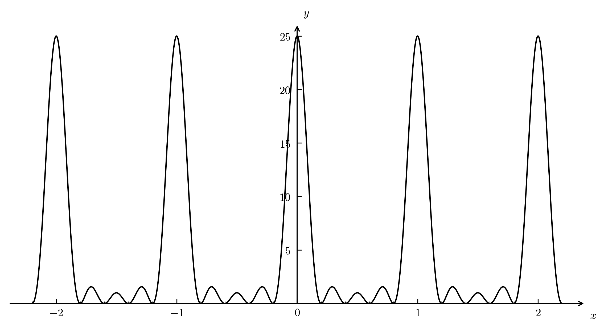

# Factoring an integer with three oscillators and a qubit

**Paper Link**: [https://arxiv.org/pdf/2412.13164](https://arxiv.org/pdf/2412.13164)

## Concept
Unlike **Shor's algorithm**, the traditional quantum integer factorization algorithm, this paper proposes a new quantum algorithm that can perform factorization using only **one qubit** and **three oscillators**.

## 1. Shor's algorithm
Shor's algorithm follows these steps:

1. Select an arbitrary integer $1 < a < N$. (Assuming $\gcd(a, N) = 1$)
2. Find the period $r$ of the function $f(x) = a^x \bmod N$ with domain $\{ 0, 1, 2, \cdots, Q-1 \}$. ($Q=2^{2n}$, $N^2 \le Q < 2N^2$)
3. If $r$ is odd or $a^{r/2} \equiv -1 \pmod N$, return to step 1.
4. Return $\gcd(a^{r/2}-1, N)$ and $\gcd(a^{r/2}+1, N)$. If these two numbers are $1$ and $N$, return to step 1.

### Step 1.
If you find an $a$ such that $\gcd(a, N) \neq 1$, then $N$ is factored into $a$ and $\dfrac{N}{a}$.

### Step 2.

After applying the Hadamard gate $H$ to the upper register, it becomes a uniform superposition state of $\dfrac{1}{\sqrt{Q}}\displaystyle\sum^{Q-1}_{x=0}\vert x \rangle$. ($Q=2^{2n}$)

The $n$-qubits in the lower register have an initial state of $\vert 1 \rangle$, and $U_{a^{2^k}}$ is applied. $U_{a^{2^k}}$ is an operation that performs $\vert x \rangle \vert y \rangle \mapsto \vert x \rangle \vert y \cdot a^{2^k} \bmod N \rangle$. (While generally $U_f: \vert x \rangle \vert z \rangle \mapsto \vert x \rangle \vert z \oplus f(x) \rangle$, in the Shor circuit it denotes $U_a: \vert x \rangle \vert y \rangle \mapsto \vert x \rangle \vert y \cdot a^x \bmod N \rangle$.)
> $U_a$ is a unitary operation because the modular multiplication operation is a one-to-one correspondence defined within the group $(\mathbb{Z}/N\mathbb{Z})^\times$.

Each bit of the upper register becomes a control qubit, ultimately calculating $\vert x \rangle \vert 1 \rangle \mapsto \vert x \rangle \vert a^x \bmod N \rangle$.
Therefore, the combined state vector of the two registers is as follows:
$$
\vert \Psi \rangle = \frac{1}{\sqrt{Q}}\displaystyle\sum^{Q-1}_{x=0}\vert x \rangle \vert a^x \bmod N \rangle
$$

Finally, the Inverse Quantum Fourier Transform $QFT_{2n}^{-1}$ is applied, which creates a distribution with high probability mass at the frequency corresponding to the period $r$. Let's examine this mathematically.

When $\omega = e^{2\pi i / Q}$, the Quantum Fourier Transform matrix $F_Q$ can be written as follows:

$$
F_Q =
\frac{1}{\sqrt{Q}}
\begin{bmatrix}
1 & 1 & 1 & \cdots & 1 \\
1 & \omega & \omega^2 & \cdots & \omega^{Q-1} \\
1 & \omega^2 & \omega^4 & \cdots & \omega^{2(Q-1)} \\
\vdots & \vdots & \vdots & \ddots & \vdots \\
1 & \omega^{Q-1} & \omega^{2(Q-1)} & \cdots & \omega^{(Q-1)^2}
\end{bmatrix}
$$

For any state vector $\psi$, the QFT acts as a linear transformation:
$$\psi'=F_Q\psi$$

Also, by the above definition, $F_Q^\dagger \cdot F_Q = I$ and $F_Q^\dagger = F_Q^{-1}$.
>
> Since $(F_Q)_{k, x} = \dfrac{1}{\sqrt{Q}}e^{2\pi ikx/Q}$, it follows that $(F_Q)_{k, x}^\dagger = \overline{(F_Q)_{k, x}} = \dfrac{1}{\sqrt{Q}}e^{-2\pi ikx/Q}$.
>
> $$
> \begin{aligned}
> \therefore (F_Q^\dagger \cdot F_Q)_{x,x'} &= \sum_{k=0}^{Q-1} (F_Q^\dagger)_{x,k} (F_Q)_{k,x'}\\
> &= \sum_{k=0}^{Q-1}\left(\frac{1}{\sqrt{Q}} e^{-2\pi i k x / Q}\right)\left(\frac{1}{\sqrt{Q}} e^{2\pi i k x' / Q}\right)\\
> &= \frac{1}{Q}\sum_{k=0}^{Q-1}e^{2\pi i k (x' - x) / Q}
> \end{aligned}
> $$
>
> If $x=x'$, then $(F_Q^\dagger \cdot F_Q)_{x, x'}=1$.
>
> If $x\neq x'$, we can derive the following from the expression with $d=x'-x$:
>
> $$
> \begin{aligned}
> (F_Q^\dagger \cdot F_Q)_{x,x'} &= \frac{1}{Q}\sum_{k=0}^{Q-1}e^{2\pi i k d / Q}\\
> &= \frac{1}{Q} \cdot \frac{1-\left(e^{2\pi i d/ Q}\right)^Q}{1-\left(e^{2\pi i d/ Q}\right)}\\
> &= \frac{1}{Q} \cdot \frac{1-e^{2\pi i d}}{1-\left(e^{2\pi i d/ Q}\right)}\\
> &= 0 \quad (\because \forall d \in \mathbb{Z},\ e^{2\pi i d} = 1)
> \end{aligned}
> $$
>
> $\therefore F_Q^\dagger \cdot F_Q = I$

As observed earlier, the observation before applying the Inverse Quantum Fourier Transform is $\vert \Psi \rangle = \dfrac{1}{\sqrt{Q}}\displaystyle\sum^{Q-1}_{x=0}\vert x \rangle \vert f(x) \rangle$, where the period of $f(x)=a^x \bmod N$ is $r$.

Let the observed value of the lower register be $y = a^{x_0} \bmod N$. In this case, $\vert x \rangle \vert f(x) \rangle$ is mapped as follows:
$$
\vert x \rangle \vert f(x) \rangle \mapsto \begin{cases}
\vert x \rangle \vert y \rangle & \text{if } f(x) = y\\
0 & \text{otherwise}
\end{cases}
$$

Therefore, the possible values for $x$ after observation are of the form $x = x_0 + kr$ ($k=0, 1, 2, \cdots, M-1$). ($M=\lfloor \dfrac{Q - x_0 - 1}{r} \rfloor+1$)

That is, the upper register becomes $\vert \Psi \rangle = \dfrac{1}{\sqrt{M}}\displaystyle\sum_{k=0}^{M-1} \vert x_0 + kr \rangle$.

After applying the Inverse Quantum Fourier Transform $F^{-1}_Q$ to the upper register, the probability that the observed value is $c$ is $P(c) = \dfrac{1}{MQ} \cdot \left|\dfrac{\sin(\pi Mrc / Q)}{\sin(\pi rc / Q)}\right|^2$.
> The state vector $\vert \Psi' \rangle$ after applying the Inverse Quantum Fourier Transform to the upper register is as follows:
> $$
> \begin{aligned}
> \vert \Psi' \rangle &= F^{-1}_Q \vert \Psi \rangle\\
> &= F^{-1}_Q \left( \frac{1}{\sqrt{M}} \sum_{k=0}^{M-1} \vert x_0 + kr \rangle \right)\\
> &= \frac{1}{\sqrt{M}} \sum_{k=0}^{M-1} F^{-1}_Q \vert x_0 + kr \rangle\\
> &= \frac{1}{\sqrt{MQ}} \sum_{k=0}^{M-1} \left(\sum_{x=0}^{Q-1} e^{-2\pi i x (x_0 + kr) / Q} \vert x \rangle \right)\\
> &= \frac{1}{\sqrt{MQ}} \sum_{x=0}^{Q-1} \left(\sum_{k=0}^{M-1} e^{-2\pi i x (x_0 + kr) / Q} \vert x \rangle \right)
> \end{aligned}
> $$
>
> The inner sum in the above equation can be simplified to $e^{-2\pi i x_0 x / Q} \displaystyle\sum^{M-1}_{k=0} \left(e^{-2\pi i x r / Q}\right)^k$, which can be calculated as the sum of a geometric series.
> $$
> \begin{aligned}
> \sum_{k=0}^{M-1} \left(e^{-2\pi i x r / Q}\right)^k &= \frac{1 - \left(e^{-2\pi i x r / Q}\right)^M}{1 - e^{-2\pi i x r / Q}}\\
> &= \frac{1 - e^{-2\pi i x r M / Q}}{1 - e^{-2\pi i x r / Q}}
> \end{aligned}
> $$
>
> $$\begin{aligned}
> \therefore \vert \Psi' \rangle &= \frac{1}{\sqrt{MQ}} \sum_{x=0}^{Q-1} \left( e^{-2\pi i x_0 x / Q} \cdot \frac{1 - e^{-2\pi i x r M / Q}}{1 - e^{-2\pi i x r / Q}} \vert x \rangle \right)\\
> \end{aligned}
> $$
>
> The probability that the observed value of the upper register is $c$ is:
> $$
> \begin{aligned}
> P(c) &= \left| \langle c | \Psi' \rangle \right|^2\\
> &= \left| \frac{1}{\sqrt{MQ}} e^{-2\pi i x_0 c / Q} \cdot \frac{1 - e^{-2\pi i c r M / Q}}{1 - e^{-2\pi i c r / Q}} \right|^2\\
> &= \frac{1}{MQ} \cdot \left| \frac{1 - e^{-2\pi i c r M / Q}}{1 - e^{-2\pi i c r / Q}} \right|^2
> \end{aligned}
> $$
> 
> Using the trigonometric identity $|1 - e^{i\theta}| = 2|\sin(\theta/2)|$, this can be written as:
> $$
> \begin{aligned}
> P(c) &= \frac{1}{MQ} \cdot \left| \frac{2\sin(\pi Mrc/ Q)}{2\sin(\pi rc / Q)} \right|^2\\
> &= \frac{1}{MQ} \cdot \left|\frac{\sin(\pi Mrc / Q)}{\sin(\pi rc / Q)}\right|^2
> \end{aligned}
> $$

The graph of $y=\left|\dfrac{\sin(\pi Mx)}{\sin(\pi x)}\right|^2$ when $M=5$ is as follows:

Thus, we can see that the measurement result $c$ is observed with high probability as a multiple of $\dfrac{Q}{r}$ (i.e., $\dfrac{sQ}{r}$). In other words, we can find an approximate value of the period $r$ via $\dfrac{c}{Q} \approx \dfrac{s}{r}$.
> Using continued fractions, we can find the approximate value $\dfrac{s}{r}$ of $\dfrac{c}{Q}$. At this time, since the range of $Q$ is $N^2 \le Q < 2N^2$, then $r < N \le \sqrt{Q}$.
> 
> Therefore, we can find a unique approximate value $\dfrac{s}{r}$ that satisfies $\left| \dfrac{c}{Q} - \dfrac{s}{r} \right| < \dfrac{1}{2r^2}$.
>
> Among these, we just need to find the $r$ that satisfies $a^{r} \equiv 1 \pmod N$.

### Step 3.
If $r$ is odd, $a^{r/2}$ in the next step is undefined, so you must return to step 1.

Also, if $a^{r/2} \equiv -1 \bmod N$, then $\gcd(a^{r/2}+1, N) = \gcd(0, N) = N$, resulting in failure of the factorization. Therefore, in this case as well, you must return to step 1.

### Step 4.
Since $a^r \equiv 1 \bmod N$, then $(a^{r/2}-1)(a^{r/2}+1) \equiv 0 \bmod N$. That is, at least one of $(a^{r/2}-1)$ and $(a^{r/2}+1)$ shares a common factor with $N$. If this common factor is not $1$ or $N$, it is a non-trivial prime factor of $N$.

## 2. Content of the Paper
In Shor's algorithm, as the size of $N$ grows, more qubits are required. This paper proposes a method to find the period of $f(x)=a^x \bmod N$ using only a single qubit and continuous variables (CV).

### Key Idea of the Paper
The Fourier transform is inherently a continuous concept, and the paper questions implementing it in the discrete space of qubits.

### Basic Mathematical Structure
In Shor's algorithm, the fact that a certain value ($x_0$) repeats every period $r$ is expressed in the form $x \equiv x_0 \pmod r$. On the other hand, this paper expresses the set of points $\{x_0 + kr \mid k \in \mathbb{Z} \}$ as a function to apply the Fourier transform. For this, the Dirac delta function $\delta(x)$ was used. The Dirac delta function is defined as follows:

$$\int^{\infty}_{-\infty} \delta(x)f(x) dx = f(0)$$

$$\delta(x)=\begin{cases}
\infty & x=0\\
0 & x \neq 0
\end{cases}
$$
> Mathematically, it is not strictly a function but is defined as a distribution.

A key property of the Dirac delta function is:
$$
\int^{\infty}_{-\infty} f(x) \delta(x-a) dx = f(a)
$$
> Substituting $y = x-x_0$:
> 
> $$\int^{\infty}_{-\infty} f(x) \delta(x-x_0) dx = \int^{\infty}_{-\infty} f(y+x_0) \delta(y) dy$$
> 
> If $f(y+x_0) = g(y)$, then:
>
> $$\begin{aligned}\int^{\infty}_{-\infty} f(y+x_0) \delta(y) &= \int^{\infty}_{-\infty} g(y) \delta(y) dy\\ &= g(0) = f(x_0)\end{aligned}$$

In other words, the Dirac delta function represents a point at $x=x_0$ as a function $\delta(x-x_0)$. Since the function value is $0$ for $x \neq x_0$, a set of infinitely many points with period $r$ can be written as:
$$g(x)=\sum_{k=-\infty} \delta(x - x_0 - kr)$$
$g(x)$ has a period $r$, and the result of the Fourier transform for a function with period $r$ is $0$ unless the frequency is an integer multiple of $\omega = \dfrac{2\pi}{r}$.
> First, let's show that $g(x)$ has a period $r$.
> $$\begin{aligned}
> g(x+r) &= \sum_{k=-\infty}^{\infty} \delta(x + r - x_0 - kr)\\
> &= \sum_{k=-\infty}^{\infty} \delta(x - x_0 - (k-1)r)\\
> &= \sum_{j=-\infty}^{\infty} \delta(x - x_0 - jr)\\
> &= g(x)
> \end{aligned}$$
> Next, let's show that the spectrum of the Fourier transform of a function with period $r$ concentrates at integer multiples of the frequency $\omega = \dfrac{2\pi}{r}$.
> 
> The Fourier transform measures how much a complex wave $e^{i\omega x}$ with frequency $\omega$ is contained within a given function $f(x)$, and the formula representing this is:
> $$F(\omega) = \int^{\infty}_{-\infty} f(x) e^{-i\omega x} dx$$
> To substitute periodicity into the Fourier transform, substituting $f(x)=f(x+r)$ into the definition:
> $$F(\omega) = \int^{\infty}_{-\infty} f(x+r) e^{-i\omega x} dx$$
> Substituting $x+r=y$:
> $$\begin{aligned}
> F(\omega) &= \int^{\infty}_{-\infty} f(y) e^{-i\omega (y-r)} dy\\
> &= e^{i\omega r} \int^{\infty}_{-\infty} f(y) e^{-i\omega y} dy\\
> &= e^{i\omega r} F(\omega)
> \end{aligned}$$
> Therefore, $F(\omega)(1 - e^{i\omega r}) = 0$. For $F(\omega) \neq 0$, it must be that $e^{i\omega r} = 1$. Since this requires $\omega r = 2n\pi$ ($n \in \mathbb{Z}$), we can see that $F(\omega)$ must be $0$ when $\omega \neq \dfrac{2n\pi}{r}$.
>
> This is similar to the context where the probability increases when $c$ is of the form $\dfrac{sQ}{r}$ in the discrete QFT expression $\dfrac{1}{MQ} \cdot \left|\dfrac{\sin(\pi Mrc / Q)}{\sin(\pi rc / Q)}\right|^2$.

### Reason for using oscillators
A quantum harmonic oscillator has continuous variables called position $x$ and momentum $p$, and the state space of these variables is infinite-dimensional. Therefore, it is suitable for representing continuous functions like the Dirac delta function.

Additionally, the Fourier transform used in Shor's algorithm can achieve the same effect by measuring the momentum $p$ of the oscillator.
> The position $x$ and momentum $p$ of the oscillator have the following relationship:
>
> $$\langle x\vert p \rangle = \frac{1}{\sqrt{2\pi}} e^{i p x}$$
> For any state vector $\vert \psi \rangle$, the position representation $\psi(x) $ is defined as $\langle x \vert \psi \rangle$, and the momentum representation $\psi(p)$ is defined as $\langle p \vert \psi \rangle$.
> 
> Thus, the state vector $\vert \psi \rangle$ can be written as:
> $$\vert \psi \rangle = \int \psi(x) \vert x \rangle dx = \int \psi(p) \vert p \rangle dp$$
>
> Also, $\psi(p)$ can be written as:
> $$\begin{aligned}
> \psi(p) &= \langle p \vert \psi \rangle\\
> &= \int \langle p \vert x \rangle \langle x \vert \psi \rangle dx\\
> &= \int \overline{\langle x \vert p \rangle} \langle x \vert \psi \rangle dx\\
> &= \frac{1}{\sqrt{2\pi}} \int e^{-i p x} \psi(x) dx
> \end{aligned}$$
>
> Now, let's find the momentum representation $g(p)$ for the function $g(x)=\displaystyle\sum_{k=-\infty} \delta(x - x_0 - kr)$ defined earlier.
> $$\begin{aligned}
> g(p) &= \frac{1}{\sqrt{2\pi}} \int e^{-i p x} \left( \sum_{k=-\infty}^{\infty} \delta(x - x_0 - kr) \right) dx\\
> &= \frac{1}{\sqrt{2\pi}} \sum_{k=-\infty}^{\infty} \int  \delta(x - x_0 - kr) e^{-i p x} dx\\
> &= \frac{1}{\sqrt{2\pi}} \sum_{k=-\infty}^{\infty} e^{-i p (x_0 + kr)} \quad \left(\because \int \delta(x-a) f(x) dx = f(a)\right)\\
> &= \frac{e^{-i p x_0}}{\sqrt{2\pi}} \sum_{k=-\infty}^{\infty} e^{-i p kr}
> \end{aligned}$$
> $\displaystyle\sum_{k=-\infty}^{\infty} e^{-i p kr}$ can be expressed as $\displaystyle\sum_{k=-\infty}^{\infty}\delta(\alpha - 2k\pi)$ using the Dirac delta function. The derivation process is as follows:
>
> Let $\displaystyle\sum_{k=-\infty}^{\infty}\delta(\alpha - 2k\pi) = \Delta(\alpha)$. Since $\Delta(\alpha)$ has a period of $2\pi$, expressing $c_k$ according to the definition of a periodic distribution:
> $$c_k = \frac{1}{2\pi}\int^{\pi}_{-\pi}\Delta(\alpha)e^{-ik\alpha} d\alpha$$
> In this case, since only $k=0$ contributes to the value of $\Delta(\alpha)$, then $\Delta(\alpha) = \delta(\alpha)$. Simplifying the expression:
> $$\begin{aligned}
> c_k &= \frac{1}{2\pi}\int^{\pi}_{-\pi}\delta(\alpha)e^{-ik\alpha} d\alpha\\
> &= \frac{1}{2\pi} \cdot e^{-ik \cdot 0} \quad \left(\because \int\delta(x)f(x) dx = f(0)\right)\\
> &= \frac{1}{2\pi}
> \end{aligned}$$
> Since $f(x)$ can be expressed as a complex Fourier series $f(x) = \displaystyle\sum_{k=-\infty}^{\infty} c_k e^{ikx}$, $\Delta(\alpha)$ can be written as:
> $$\begin{aligned}
> \Delta(\alpha) &= \sum_{k=-\infty}^{\infty} c_k e^{ik\alpha}\\
> &= \sum_{k=-\infty}^{\infty} \frac{1}{2\pi} e^{ik\alpha}\\
> &= \frac{1}{2\pi} \sum_{k=-\infty}^{\infty} e^{ik\alpha}
> \end{aligned}$$
> $$\therefore \sum_{k=-\infty}^{\infty} e^{ik\alpha} = 2\pi \Delta(\alpha) = 2\pi \sum_{k=-\infty}^{\infty} \delta(\alpha - 2k\pi)$$
> Therefore, $\displaystyle\sum_{k=-\infty}^{\infty} e^{-i p kr} = 2\pi \sum_{k=-\infty}^{\infty} \delta(p r - 2k\pi)$. Using the scaling property of the Dirac delta function ($\delta(a x) = \dfrac{1}{|a|} \delta(x)$), then $\delta(p r - 2k\pi) = \dfrac{1}{r} \delta\left(p - \dfrac{2k\pi}{r}\right)$.
> 
> Thus, $\displaystyle\sum_{k=-\infty}^{\infty} e^{-i p kr} = \dfrac{2\pi}{r} \displaystyle\sum_{k=-\infty}^{\infty} \delta\left(p - \dfrac{2k\pi}{r}\right)$, and finally $g(p)$ can be written as follows:
> $$\begin{aligned}
> g(p) &= \frac{e^{-i p x_0}}{\sqrt{2\pi}} \cdot \frac{2\pi}{r} \sum_{k=-\infty}^{\infty} \delta\left(p - \frac{2k\pi}{r}\right)\\
> \therefore g(p) &\propto \sum_{k=-\infty}^{\infty} \delta\left(p - \frac{2k\pi}{r}\right)
> \end{aligned}$$
> Therefore, the structure of the position space having period $r$ appears as an integer multiple of the frequency $\omega = \dfrac{2\pi}{r}$ in momentum space, and the period $r$ can be extracted by measuring momentum.

In this paper, the three oscillators play the following roles:
1. First oscillator: Stores variable $x$ as an input register
    > Similar to how the upper register in Shor's algorithm encodes the $x$ value. Although $x$ is a continuous variable, it acts like a bit string, conceptually performing operations like $x \mapsto \lfloor x \rfloor \bmod 2$, $x \mapsto \lfloor x / 2 \rfloor$.
    > 
    > To make this possible, a GKP state (Gottesman-Kitaev-Preskill state) is used to reliably store the continuous variable $x$. The basic lattice unit of GKP is $\sqrt{\pi}$, and the GKP state is expressed as follows:
    > $$\psi_{GKP}(x)=\sum_{k\in \mathbb{Z}}\delta(x-k\sqrt{\pi})$$
    > Noise (small movement) in $x$ is absorbed by the lattice structure, making it appear as a state fixed to integer lattices upon measurement.
    >
    > However, since infinite momentum variance is impossible in real physical systems, an approximate GKP state is used to maintain a periodic lattice structure.
    > $$\psi(x)=\sum_{k\in\mathbb{Z}}e^{-\frac{(x-kr)^2}{2\sigma^2}}$$
2. Second oscillator: Stores $f_{a,N,m}(x)$ as a work register
    > $f_{a,N,m}(x)$ is a pseudo-modular power function defined to have the same periodic structure as $f(x)=a^x \bmod N$ in Shor's algorithm, playing a role similar to the lower register.
    >
    > At this time, the unitary $U_{a,N,m}$ is implemented by combining the following two operations:
    >
    > Scalar multiplication-based change: $y \rightarrow \alpha y$
    >
    > Shift: $y \rightarrow y + R$
    >
    > $$U_{a,N,m} \vert x \rangle \vert y \rangle = \vert x \rangle \vert y + f_{a,N,m}(x) \rangle$$
    > Since $f_{a,N,m}(x)$ is a function with a nonlinear periodic structure, it is constructed step-by-step through bit-wise decomposition, much like in Shor's algorithm.
    >
    > By accumulating $c_j$ (constant displacement amount corresponding to $a^{2^j} \bmod N$) as a conditional shift according to each bit $x_j$, $f_{a,N,m}(x)$ can be defined as follows:
    > $$f_{a,N,m}(x)\;:=\;\sum_{j=0}^{m-1} x_j \cdot c_j$$
    > 
    > That is, it can be accumulated in the work register only by combining scale changes and shift operations.
    > 
    > In actual implementation, modular multiplication is performed by combining a SUM gate (CV version of CNOT) and a Squeezing gate. In particular, a Conditional Displacement operation is used to perform $a^{2^j} \pmod N$ according to each bit of $x$, which is the core technology of this paper that approximates nonlinear $f(x)$ as a combination of linear gates in CV systems.
3. Third oscillator: Used as an auxiliary register for LSB extraction and bit shifting
    > The third oscillator is used as an auxiliary register needed in the process of extracting the LSB from the continuous variable $x$ encoded in the first oscillator and responding to bit shifts.

### Reason for using a qubit
While continuous variable oscillators alone can generate the periodic structure itself, they cannot perform conditional operations based on bit values, and the measurement distribution becomes a sum of multiple periods, making accurate period extraction difficult. Therefore, a qubit is used to perform conditional control. The paper refers to this process as a hybrid Qubit-Oscillator system.

Assuming the phase corresponding to the period we want to find is $\phi = 0.\phi_1\phi_2\phi_3\dots\phi_m$ (binary), Shor's algorithm used $m$ qubits to estimate $\phi_1, \phi_2, \cdots, \phi_m$ all at once, whereas this paper uses only a single qubit to estimate from $\phi_m$ to $\phi_1$ sequentially. The reason for estimating from the lower bits is that if measured from the upper bits, interference with the lower bits occurs, making accurate estimation difficult. Therefore, estimating from the lower bits allows for accurate estimation without interference from the upper bits.

When the qubit is placed in the $\vert + \rangle = \dfrac{\vert 0 \rangle + \vert 1 \rangle}{\sqrt{2}}$ state and a control operation is performed, a Phase Kickback phenomenon occurs where the phase of the target state (Oscillator) is transferred to the control qubit, and a value of $0$ or $1$ is obtained through measurement.
> Before explaining, let's show that the eigenvalue of $U$ is $e^{2\pi i \phi}$.
>
> The unitary operator $U$ is defined as $U \vert y \rangle = \vert ay \bmod N \rangle$. Since applying the $U$ operation $r$ times to $\vert 1 \rangle$ eventually returns it to $\vert 1 \rangle$, $U^r = I$. Therefore, the eigenvalue $\lambda$ of $U$ must satisfy $\lambda^r = 1$, can be written in the form $\lambda = e^{2\pi i \phi}$ ($\phi = \dfrac{s}{r}, s \in \{0, 1, \cdots, r-1\}$), and $U\vert \psi \rangle = e^{2\pi i \phi} \vert \psi \rangle$.
> 
> Applying the control gate $CU$ applies $U$ to the target state when the control qubit is $\vert 1 \rangle$.
> $$\begin{aligned}
> CU \vert + \rangle \vert \psi \rangle &= \frac{1}{\sqrt{2}} \left( \vert 0 \rangle \vert \psi \rangle + \vert 1 \rangle U \vert \psi \rangle \right)\\
> &= \frac{1}{\sqrt{2}} \left( \vert 0 \rangle \vert \psi \rangle + \vert 1 \rangle e^{2\pi i \phi} \vert \psi \rangle \right)\\
> &= \left( \frac{\vert 0 \rangle + e^{2\pi i \phi} \vert 1 \rangle}{\sqrt{2}}\right) \otimes \vert \psi \rangle
> \end{aligned}$$
> Thus, the period $\phi$ is included in the phase of the control qubit (Phase Kickback).

If the result of measuring the $m$-th bit ($\phi_m$) is $1$, the phase causes interference when measuring the next bit ($\phi_{m-1}$), requiring correction.
> Expressing the phase as $\phi = \dfrac{\phi_1}{2^1} + \dfrac{\phi_2}{2^2} + \cdots + \dfrac{\phi_m}{2^m} \quad (\phi_j \in \{0, 1\})$, the phase kicked back when performing the $U^{2^{k-1}}$ operation in the $k$-th step is as follows:
> $$\begin{aligned}
> 2^{k-1}\phi &= 2^{k-1} (0.\phi_1\phi_2\cdots\phi_k\cdots\phi_m) \\
> &= \underbrace{\phi_1\phi_2\cdots\phi_{k-1}}_{\text{integer part}} . \underbrace{\phi_k\phi_{k+1}\cdots\phi_m}_{\text{fractional part}}
> \end{aligned}$$
> Since the phase in a quantum state cycles with a period of $2\pi$, the integer part becomes $e^{2\pi i \cdot \text{integer part}} = 1$, so only the fractional part needs to be considered. Therefore, the phase remaining in the $k$-th step is $2\pi(0.\phi_k\phi_{k+1}\cdots\phi_m)$.
> When measuring the current bit $\phi_k$, the already measured lower bits ($\phi_{k+1}$, $\phi_{k+2}$, $\cdots$, $\phi_m$) cause interference.

At this time, the phase is corrected using an $R_z(-\theta)$ gate.
> Interference must be removed using the already known lower bits $\phi_{k+1}$, $\phi_{k+2}$, $\cdots$, $\phi_m$, and the applied rotation angle $\theta_k$ is as follows:
> $$\begin{aligned}\theta_k &= 2\pi \left(0.0\phi_{k+1}\phi_{k+2}\cdots\phi_m\right)\\
> &= 2\pi \sum_{j=k+1}^{m} \frac{\phi_j}{2^{j-k+1}}
> \end{aligned}$$
> That is, applying $R_z(-\theta_k)$ rotates the phase of the $\vert 1 \rangle$ state by $- \theta_k$, removing the interference.
> $$\begin{aligned}
> &2\pi (0.\phi_k\phi_{k+1}\dots\phi_m) - 2\pi (0.0\phi_{k+1}\dots\phi_m) \\
> =&\ 2\pi (0.\phi_k) = 2\pi \cdot \frac{\phi_k}{2} = \pi \phi_k
> \end{aligned}$$
> The phase of the corrected qubit becomes $\pi \phi_k$, and measuring it after applying the Hadamard gate yields the $\phi_k$ value.
> 
> If $\phi_k = 0$, the phase becomes $0$ and the qubit is $\vert + \rangle$
> 
> If $\phi_k = 1$, the phase becomes $\pi$ and the qubit is $\vert - \rangle$

The reason only a single qubit is used here is because the Iterative Phase Estimation (IPE) algorithm, which sequentially estimates bits one by one starting from the LSB, was utilized.

### Final Summary
This study re-examines the essence of Shor's algorithm from the perspective of selecting a periodic structure and shows that it can be implemented as a physically feasible circuit by combining a continuous variable system with a single qubit.

## Note
This is a design that swaps space complexity (number of qubits) for hardware precision. It will serve as an important milestone showing how to efficiently utilize the infinite-dimensional state space of continuous variable systems in the current transition period of quantum computing, where qubit resources are extremely limited.