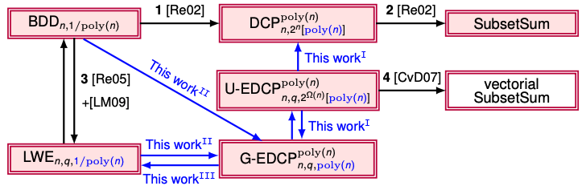

# Learning With Errors and Extrapolated Dihedral Cosets

**논문 링크**: [https://arxiv.org/pdf/1710.08223](https://arxiv.org/pdf/1710.08223)

## Motivation
LWE는 양자적으로 어려운지 구조적으로 설명되지 않는다. 따라서 HSP 구조가 있어 양자 알고리즘 분석이 가능한 DCP로 reduction하여 LWE가 양자적으로 어려운지 여부를 파악할 수 있다.

하지만 기존의 LWE에서 DCP로의 reduction은 tight하지 않기 때문에, DCP의 완화 문제인 EDCP를 정의하고, LWE와 EDCP가 양자 다항시간 reduction 하에서 동등하다는 것을 보였다.

## 배경 지식
### LWE
LWE(Learning With Errors) 문제는 search LWE와 decision LWE로 나뉜다.

search LWE는
$$b_i = \langle \mathbf{a}_i, s \rangle + e_i \pmod{q}$$
에서 $\mathbf{a}_i \xleftarrow{\$} \mathbb{Z}_q^n$, $s \in \mathbb{Z}_q^n$, $e_i \sim \mathcal{D}_{\mathbb{Z},\alpha q}$ 이고,
$m \ge n$ 개의 샘플 $(\mathbf{a}_i, b_i)$가 주어졌을 때 비밀 벡터 $s$를 복구하는 문제이다.

decision LWE는 $\textbf{a}_i\in\mathbb{Z}_q^n$, $b_i\in\mathbb{Z}_q$ 일 때, 주어진 $m \ge n$개 샘플 $(\textbf{a}_i, b_i)$를 보고 LWE distribution sample인지, uniform random sample인지 구별하는 문제이다.
> $\mathcal{D}_{\mathbb{Z}, \alpha q}$ 는 $\alpha q$의 표준편차를 가지는 이산 가우시안 분포이며, 수식적으로 $\forall k \in \mathbb{Z}$에 대해, $\mathcal{D}_{\mathbb{Z}, \alpha q}(k) \sim \exp\left( -\pi k^2/(\alpha q)^2\right)$를 의미한다. 풀어 써보면, 이는 연속 가우시안 분포를 이산화하여 정수 격자 위에서 고려하는 것을 의미한다.
> 
> LWE에서 가우시안 분포를 사용하는 이유는 LWE의 hardness는 worst-case lattice problem $\rightarrow$ LWE의 reduction으로부터 증명되고, reduction이 성립하기 위해 error를 discrete Gaussian으로 두어야 한다. 이 논문에서는 이와 다르게 가우시안 분포의 푸리에 변환 결과를 이용한다.

LWE를 왜 사용하는지를 이해하기 위해, 기존 암호 알고리즘이 양자 알고리즘에 취약하다는 것을 살펴보자.

RSA의 소인수 분해 문제와 이산 로그 문제를 해결하는 Shor's algorithm을 포함하여 많은 양자 알고리즘은 Hidden Subgroup Problem (HSP)을 해결하는 알고리즘으로 볼 수 있다.

> Hidden Subgroup Problem
>
> group $G$와 함수 $f : G \rightarrow X$가 있을 때, $f(g_1) = f(g_2) \iff g_1H=g_2H$를 만족하는 hidden subgroup $H \subseteq G$를 찾는 문제이다.

소인수 분해, 이산 로그 문제 등은 Abelian group에 대한 HSP로 환원되고, 이는 quantum polynomial time으로 해결 가능하다. 하지만 LWE는 $e$라는 noise 때문에 주기적 구조나 hidden subgroup 구조가 없고, HSP 기반 양자 알고리즘을 직접 적용할 수 없다.

또한 LWE는 worst-case lattice problems와의 reduction이 알려져 있어, LWE를 효율적으로 해결할 수 있다면 lattice에서의 worst-case 문제들(SVP, GapSVP)을 해결할 수 있음이 알려져 있다. 이러한 lattice 문제들은 현재까지 양자 컴퓨터에서도 효율적인 polynomial time 알고리즘이 알려져 있지 않으며, 이에 따라 LWE도 양자 환경에서 어려운 문제로 conjectured 된다. 따라서 LWE는 Post-Quantum Cryptography의 핵심 hardness assumption으로 사용된다.

### DCP
DCP(Dihedral Coset Problem)는 임의의 $x \in \mathbb{Z}_N$를 포함하는 $l$개의 양자 상태 $\dfrac{1}{\sqrt{2}}\left(\vert 0 \rangle \vert x \rangle + \vert 1 \rangle \vert (x + s) \bmod N \rangle \right)$이 주어졌을 때 secret $s \in \mathbb{Z}_N$를 복구하는 문제이다.

DCP는 dihedral group($D_N$) 위에서 정의되고, 이는 non-abelian group이다.
> Dihedral Group
> 
> Dihedral Group은 정$N$각형의 모든 대칭 변환의 집합으로, 원소는 회전($r: 360/N\degree$회전, rotation)과 대칭($s$, reflection)이 있다.
> $$ D_N = \langle r, s \mid r^N=1, s^2=1, srs=r^{-1} \rangle $$
> $D_N$이 non-abelian group임을 보이기 위해, 아래의 과정을 생각하자.
> $$\begin{aligned}
> srs &= r^{-1}\\
> r^{-1}s &= srss\\
> &= sr \quad (\because s^2=1)
> \end{aligned}$$
> abelian group을 만족하기 위해서 $sr=r^{-1}s=rs$를 만족해야 하는데, $N \ge 3$에 대해 $r \neq r^{-1}$이기 때문에 $D_N$은 non-abelian group이다.

secret $s$를 찾는 hidden shift 문제는 shift 연산($x \mapsto x+1$)과 flip branch 연산($0 \leftrightarrow 1$)을 같이 고려해야 하므로, shift 연산을 rotation에, flip branch 연산을 reflection으로 고려한다면 두 연산으로 생성되는 군이 dihedral group이 된다.

DCP에서 주로 $\dfrac{1}{\sqrt{2}}\left( \vert 0, x \rangle + \vert 1, x+s \rangle \right)$의 상태로부터 $s$를 찾기 때문에, 한 branch에서 위치가 $x$, 다른 branch에서 위치가 $x+s$로 연결되어 있어, $s$를 찾는 것은 dihedral HSP가 된다.

dihedral HSP가 어려운 이유는 푸리에 변환 이후 정보가 깔끔하게 나오지 않기 때문이다. abelian group $G=\mathbb{Z}_N$에서 푸리에 변환은 $\vert x \rangle \mapsto \dfrac{1}{\sqrt{N}}\sum^{N-1}_{k=0}{w_N}^{kx}\vert k \rangle$($w_N=e^{2\pi i / N}$)이고, 측정된 결과가 주기 $r$에 대한 선형 제약이며, 이 제약을 통해 subgroup을 재구성할 수 있다.

dihedral HSP에서 푸리에 변환 이후 $\dfrac{1}{\sqrt{2}}\left( \vert 0 \rangle + e^{2\pi i k s / N} \vert 1 \rangle \right)$의 형태로 바뀌기 때문에, abelian group에 결과가 깔끔하지 않다는 것을 알 수 있다.
> 시작 상태가 $\dfrac{1}{\sqrt{2}}\left( \vert 0, x \rangle + \vert 1, x+s \rangle \right)$ 이고, 여기에 QFT의 정의 $QFT_N \vert y \rangle = \dfrac{1}{\sqrt{N}}\sum^{N-1}_{k=0}{w_N}^{ky}\vert k \rangle$를 적용하면 아래와 같다.
> $$\begin{aligned}
> \vert x \rangle &\mapsto \dfrac{1}{\sqrt{N}}\sum^{N-1}_{k=0}{w_N}^{kx}\vert k \rangle\\
> \vert x + s \rangle &\mapsto \dfrac{1}{\sqrt{N}}\sum^{N-1}_{k=0}{w_N}^{k(x+s)}\vert k \rangle\\
> \end{aligned}$$
> 정리해보면 아래와 같다.
> $$\begin{aligned}
> &\dfrac{1}{\sqrt{2}}\left( \vert 0 \rangle \sum^{N-1}_{k=0}{w_N}^{kx}\vert k \rangle + \vert 1 \rangle \sum^{N-1}_{k=0}{w_N}^{k(x+s)}\vert k \rangle \right)\\
> = &\frac{1}{\sqrt{2N}}\sum_k\left( \vert 0 \rangle {w_N}^{kx} + \vert 1 \rangle {w_N}^{k(x+s)} \right) \vert k \rangle\\
> = &\frac{1}{\sqrt{2N}}\sum_k{w_N}^{kx}\left( \vert 0 \rangle + {w_N}^{ks} \vert 1 \rangle \right) \vert k \rangle\\
> \end{aligned}$$
> 두 번재 레지스터 $k$를 측정하면 측정 후 상태는 $\dfrac{1}{\sqrt{2}}\left( \vert 0 \rangle + {w_N}^{ks} \vert 1 \rangle \right) = \dfrac{1}{\sqrt{2}}\left( \vert 0 \rangle + e^{2 \pi i k s / N} \vert 1 \rangle \right)$이 된다.

이 상태는 $ks \bmod N$의 정보를 담고 있기 때문에 많은 상태를 모으면 secret $s$를 복구할 수 있다.

효율적인 DCP 해결 알고리즘으로는 Kuperberg's Algorithm이 있으며, 시간복잡도는 $\mathcal{O}\left( 2^{c\sqrt{\log N}} \right)$으로, subexponential algorithm은 알려져 있지만, polynomial time 알고리즘은 알려져 있지 않다.

### EDCP
DCP가 $\vert 0 \rangle$과 $\vert 1 \rangle$의 두 branch를 살펴보았다면, EDCP(Extended Dihedral Coset Problem)는 여러 branch를 살펴보는 문제이다.

EDCP도 LWE와 마찬가지로 Search Extrapolated Dihedral Coset Problem($\text{EDCP}^l_{n,N,D}$)과 Decisional Extrapolated Dihedral Coset Problem($\text{dEDCP}^l_{n,N,D}$)가 있다.

$\text{EDCP}^l_{n,N,D}$는 아래와 같이 임의의 $\mathbf{x} \in \mathbb{Z}_N^n$에 대해 $l$개의 input이 주어졌을 때, $s \in \Z_N^n$를 찾으면 된다.

$$ \sum_{j\in \text{supp}(D)} D(j)\vert j \rangle \vert (\mathbf{x}+j\cdot s) \bmod N \rangle $$

$\text{dEDCP}^l_{n,N,D}$는 $l$개의 sample에 대해, 이 sample이 EDCP인지, $\vert j_k \rangle \vert \mathbf{x}_k \bmod N \rangle$ (단, $j_k \sim D$, $\mathbf{x}_k \in \mathbb{Z}^n_N$, $1\le k \le l$이다.)인지 구별하는 문제이다.

논문에서 사용하는 EDCP는 U-EDCP와 G-EDCP로 나뉜다. 먼저 U-EDCP($\text{U-EDCP}^l_{n,N,M}$)를 살펴보면, $D$가 $\mathbb{Z}_M$($M\in\mathbb{Z}$)에서 uniform하다는 뜻이다. 이를 수식으로 나타내면 아래와 같다.

$$ \left\{ \frac{1}{\sqrt{M}} \sum_{j=0}^{M-1} \vert j \rangle \vert (\mathbf{x}_k + j \cdot \mathbf{s}) \bmod N \rangle \right\}_{k\le l} $$

G-EDCP($\text{G-EDCP}^l_{1,N,r}$)는 $D$가 가우시안 분포 $\mathcal{D}_{\mathbb{Z}, r}$을 따른다는 것이다. 이를 수식으로 나타내면 아래와 같다.

$$ \left\{ \sum_{j\in\mathbb{Z}} \rho_r(j) \vert j \rangle \vert (\mathbf{x}_k + j \cdot \mathbf{s}) \bmod N \rangle \right\}_{k\le l} $$
> $\rho_r(j) = e^{-\pi j^2/r^2}$으로, 정수 $j$에 대한 Gaussian weight를 의미한다.

## 2. LWE와 EDCP의 reduction

### $\text{LWE}^m_{n,q,\alpha} \le_q \text{G-EDCP}^l_{n,q,r}$ 
이 논문에서는 두 가지 방법으로 reduction을 보였다. 먼저, cube separation 방법을 살펴보자.

$\text{LWE}^m_{n,q,\alpha}$ 로부터 생성된 $(\mathbf{A}, \mathbf{b}_0=\mathbf{A} \cdot \mathbf{s}_0 + \mathbf{e}_0 \bmod q)$가 있을 때, $\text{G-EDCP}^l_{n,q,r}$ oracle을 이용하여 $\mathbf{s}_0$를 찾을 수 있음을 보이자.

우선 모든 가능한 secret 후보 $\mathbf{s}$를 균일하게 배치한 상태를 아래와 같이 정의할 수 있다.
$$\sum_{\mathbf{s} \in \mathbb{Z}^n_q} \vert 0 \rangle \vert s \rangle \vert 0 \rangle$$

이후 첫 번째 레지스터를 $\vert 0 \rangle$로 두지 않고, $\displaystyle\sum_{j\in\mathbb Z}\rho_r(j)\vert j \rangle$로 바꾼다.
> Lemma 4. 주어진 파라미터 $\kappa$와 정수 $r$에 대해, 정규화된 상태 $\displaystyle\sum_{x\in\mathbb Z} \rho_r(x) \vert x \rangle$에 대해 $l_2$거리 $2^{-\Omega(\kappa)}$이내인 상태를 효율적으로 출력하는 양자 알고리즘이 있다. [Lemma 3.12 (Regev 05)](https://arxiv.org/pdf/2401.03703)
>
> $l_2$거리가 $2^{\Omega(\kappa)}$이내, 즉 negligible 하게 작다는 뜻은 두 양자 상태가 기하학적으로 유사하다는 것을 의미한다.

또한, 앞선 state $\displaystyle\sum_{s \in \mathbb Z^n_q}\left( \displaystyle\sum_{j\in\mathbb Z}\rho_r(j)\vert j \rangle \right) \vert s \rangle \vert 0 \rangle$에서 $l_2$거리가 $2^{\Omega(\kappa)}$ 이내인 state는 아래와 같이 나타낼 수 있다.
$$ \sum_{\mathclap{\substack{
    \mathbf{s} \in \mathbb{Z}_q^n \\
    j \in \mathbb{Z} \cap [-\sqrt{\kappa}r,\sqrt{\kappa}r]
}}}
\rho_r(j)\ket{j}\ket{\mathbf{s}}\ket{0}$$
> Lemma 1. 어떤 $r$, $\kappa > 0$에 대해, $\rho_r(\mathbb Z \backslash [-\sqrt{\kappa}r, \sqrt{\kappa}r]) < 2^{-\Omega(\kappa)}\rho_r(\mathbb Z)$이다.
>
> 즉, 가우시안 분포의 꼬리는 극도로 작으므로, 꼬리를 잘라낸 상태로 바꿔도 양자 상태가 거의 변하지 않는다는 의미이다. (무한한 Gaussian 중첩을 유한 범위로 잘라도 양자적으로 거의 유사하다)

함수 $f(j, \mathbf{s}) \mapsto \mathbf{A}\mathbf{s} - j \cdot \mathbf{b} \bmod q$의 결과를 세 번째 레지스터에 저장할 경우 아래와 같이 식 정리를 할 수 있다.
$$\begin{aligned}
\sum_{\mathclap{\substack{
    \mathbf{s} \in \mathbb{Z}_q^n \\
    j \in \mathbb{Z} \cap [-\sqrt{\kappa}r,\sqrt{\kappa}r]
}}}
\rho_r(j)\ket{j}\ket{\mathbf{s}}\ket{\mathbf{As}-j\cdot \textbf{b} \bmod q} &= \sum_{\mathclap{\substack{
    \mathbf{s} \in \mathbb{Z}_q^n \\
    j \in \mathbb{Z} \cap [-\sqrt{\kappa}r,\sqrt{\kappa}r]
}}}
\rho_r(j)\ket{j}\ket{\mathbf{s}}\ket{\mathbf{As}-j\cdot \textbf{A} \textbf{s}_0 - j\textbf{e}_0}\\
&= \sum_{\mathclap{\substack{
    \mathbf{s} \in \mathbb{Z}_q^n \\
    j \in \mathbb{Z} \cap [-\sqrt{\kappa}r,\sqrt{\kappa}r]
}}}
\rho_r(j)\ket{j}\ket{\mathbf{s} + j\textbf{s}_0}\ket{\mathbf{As} - j\textbf{e}_0} \quad (\textbf{s} \mapsto \textbf{s}+j\textbf{s}_0)
\end{aligned}$$
> $\textbf{s} \mapsto \textbf{s}+j\textbf{s}_0$가 성립하는 이유는, 유한 아벨 군($\mathbb Z_q^n$)에서 평행이동은 전단사이므로 합의 전체 값은 그대로이기 때문이다.

다음으로 $w_1, \cdots, w_m \xleftarrow{\$}[0, 1)$, $z=q/\overline{q}$ ($\overline{q}$는 $\overline{q} \ge 8$인 상수) 에 대해서 함수
$$g(\mathbf{x}) = \left( \left\lfloor (x_1 / z - w_1) \bmod \overline{q} \right\rfloor, \ldots, \left\lfloor (x_m / z - w_m) \bmod \overline{q} \right\rfloor \right)$$
를 정의할 수 있다. 이 함수 $g$는 $\bmod\ q$상의 공간의 값을 $\bmod\ \overline{q}$의 cell 번호로 바꾸는 역할을 한다. 랜덤한 $w_i$를 빼는 이유는 정수 경계 근처에서 floor 연산으로 인해 값이 민감하게 바뀌는 것을 막기 위함이다.

앞서 정의한 함수 $g$를 이용해서 $g(\mathbf{As}-j\cdot \mathbf{e}_0)$의 값을 새로운 레지스터에 저장한다. 즉, state는 아래와 같이 작성된다.
$$\sum_{\mathclap{\substack{
    \mathbf{s} \in \mathbb{Z}_q^n \\
    j \in \mathbb{Z} \cap [-\sqrt{\kappa}r,\sqrt{\kappa}r]
}}}
\rho_r(j)\ket{j}\ket{\mathbf{s} + j\textbf{s}_0}\ket{\mathbf{As} - j\textbf{e}_0}\ket{g(\mathbf{As}-j\cdot \mathbf{e}_0)}$$

네 번째 레지스터는 측정만을 위한 레지스터이고, $g(\mathbf{As}-j\cdot \mathbf{e}_0)$를 측정할 경우 같은 셀에는 같은 $\mathbf s$에 대한 값들만 남게 된다.
> Lemma 12. 어떤 $\textbf u = \mathbf{Ax}+\textbf e_1$, $\textbf v = \mathbf{Ax}+ \textbf e_2$에 대해, $\|\mathbf e_1 \|_\infty, \|\mathbf e_2 \|_\infty \le \dfrac{\lambda_1^\infty(\Lambda_q(\textbf A))}{2ck}$일 때 $(1-1/k)^m$의 확률로 $g(\textbf u)=g(\textbf v)$ 이다.
> 
> 또한, 어떤 $\textbf u = \mathbf{Ax}+\textbf e_1$, $\textbf v = \mathbf{A}\widehat{\mathbf{x}}+ \textbf e_2$에 대해, $\|\mathbf e_1 \|_\infty, \|\mathbf e_2 \|_\infty \le \dfrac{\lambda_1^\infty(\Lambda_q(\textbf A))}{2ck}$일 때 $x \neq \widehat{\mathbf{x}} \in \mathbb Z_q^n$이면 $g(\mathbf u) \neq g(\mathbf v)$이다.

또한 Lemma 1에 의해 $\|\mathbf e_0\|_\infty \le \sqrt{\kappa}\alpha q$일 확률은 $1-2^{-\Omega(m)}=1-2^{-\Omega(\kappa)}$보다 크거나 같다. 또한 논문에서 $r < \dfrac{1}{32ml\kappa \alpha q^{n/m}}\le \dfrac{1}{4ck\kappa\alpha q ^{n/m}}$ (단, $c=8$, $k=ml$)인 상황에서의 reduction을 보기 때문에, $\|\sqrt{\kappa}r\cdot\mathbf e \|_\infty \le \dfrac{\lambda_1^\infty(\Lambda_q(\textbf A))}{2ck}$를 만족한다.
> 앞서 설명한 바에 따르면, $\vert j\vert \le \sqrt{\kappa}r$이고, $\|\mathbf e_0\|_\infty \le \sqrt{\kappa}\alpha q$이다. 두 식을 곱하면
> $$ \| j \mathbf e_0 \|_\infty \le \|\sqrt{\kappa}r\cdot\mathbf e \|_\infty  \le (\sqrt{\kappa}r)(\sqrt{\kappa}\alpha q) = \kappa r \alpha q$$
> 가 되고, $r$의 bound를 고려하면 최종적으로 아래의 식이 된다.
> $$ \|\sqrt{\kappa}r\cdot\mathbf e \|_\infty \le \kappa \cdot \dfrac{1}{4ck\kappa\alpha q ^{n/m}} \cdot \alpha q = \frac{q^{1-n/m}}{4ck} $$
> Lemma 5. uniform하게 선택된 행렬 $\textbf A \in \mathbb Z_q^{m\times n}$과 $m \ge n$에 대해, $\lambda_1^\infty(\Lambda_q(\textbf A)) \ge \dfrac{q^{(m-n)/m}}{2}$이고, $\lambda_1^\infty(\Lambda_q^\perp(\textbf A)) \ge \dfrac{q^{n/m}}{2}$일 확률은 $1-2^{-m}$이다.
> 
> Lemma 5에 따라, 식을 다시 정리해보면
> $$ \|\sqrt{\kappa}r\cdot\mathbf e \|_\infty \le \frac{q^{1-n/m}}{4ck} \le \frac{\lambda_1^\infty(\Lambda_q(\textbf A))}{2ck} $$
> 가 된다.

따라서 $g(\mathbf{As}-j\cdot \mathbf{e}_0)$를 측정하면 같은 $\textbf s$만 남게 되어 state는 아래와 같이 된다.
$$ \sum_{\mathclap{
    j \in \mathbb{Z} \cap [-\sqrt{\kappa}r,\sqrt{\kappa}r]
}}
\rho_r(j)\ket{j}\ket{\mathbf{s} + j\textbf{s}_0}\ket{\mathbf{As} - j\textbf{e}_0} $$

함수 $(j, \mathbf s, \mathbf b) \mapsto \mathbf b - \mathbf{As} + j \cdot \mathbf b_0$의 함수에 대해 세 레지스터의 값을 대입해보면
$$\begin{aligned}
(\mathbf{As}-j\mathbf e_0) - \mathbf A(\mathbf s + j \mathbf s_0) + j\mathbf b_0 &= (\mathbf{As}-j\mathbf e_0) - \mathbf A(\mathbf s + j \mathbf s_0) + j(\mathbf{As}_0 + \mathbf e_0)\\
&= 0
\end{aligned}$$
이 된다. 즉, 세 번째 레지스터의 값은 앞의 두 레지스터로부터 도출되는 결과이므로, 지울 수 있게 된다.
$$ \sum_{\mathclap{
    j \in \mathbb{Z} \cap [-\sqrt{\kappa}r,\sqrt{\kappa}r]
}}
\rho_r(j)\ket{j}\ket{\mathbf{s} + j\textbf{s}_0} $$

마지막으로 Lemma 1에 따르면 truncated Gaussian 상태는 full Gaussian 상태와 $l_2$거리가 $2^{-\Omega(\kappa)}$ 이내로 가깝기 때문에, 아래와 같이 나타낼 수 있다.

$$ \sum_{j\in \mathbb Z}
\rho_r(j)\ket{j}\ket{\mathbf{s} + j\textbf{s}_0} $$

위의 과정을 $l$번 반복할 경우, $\left( 1 - \dfrac{1}{k} \right)^{ml}$의 확률로 $l$개의 state를 얻을 수 있고, $\text{G-EDCP}^l_{n,q,r}$ 오라클을 통해 secret $\textbf s$를 복구할 수 있다.

다음으로 balls' intersection 방법에 대해 살펴보자. 위에서 살펴본 큐브를 이용해 $\mathbb Z^m$ 공간으로 나눈 것과 달리, $\textbf{As}$ 및 shift된 점을 기준으로 그려진 공들의 교집합을 생각하여, $r$의 범위를 $r < \dfrac{1}{32m \kappa \alpha l q^{n/m}}$에서 $r < \dfrac{1}{6 \sqrt{2\pi e} \sqrt{m\kappa}l\alpha q^{(n+1)/m}}$으로 더 완화했다.
> $r$의 범위가 늘어나면 더 많은 shift 정보를 얻을 수 있고, reduction이 더 강력해진다.

cube separation 방법에서 사용했던 것과 동일하게, state를
$$\sum_{\mathclap{\substack{
    \mathbf{s} \in \mathbb{Z}_q^n \\
    j \in \mathbb{Z} \cap [-\sqrt{\kappa}r,\sqrt{\kappa}r]
}}}
\rho_r(j)\ket{j}\ket{\mathbf{s} + j\textbf{s}_0}\ket{\mathbf{As} - j\textbf{e}_0}$$
로 나타낼 수 있다.

이후 discretization parameter $L=2^m$으로 잡는데, 이는 연속적인 ball 전체를 다루지 않고, 점들을 스케일된 격자 $\dfrac{1}{L}\mathbb Z^m$위의 점들로 근사하기 위함이다. 그리고 ball의 반지름을 $R=\Theta(\sqrt{m}q^{(m-n)/m})$으로 둔다.
> 서로 다른 $\mathbf{s}\neq \mathbf{s}'$이면 두 점 사이의 거리$\| \mathbf{As} - \mathbf{As}' \| \ge \lambda_1(\Lambda_q(\mathbf{A}))$ 여야 한다. ($\lambda_1(\Lambda_q(\mathbf{A}))$는 0이 아닌 lattice 벡터 중 가장 짧은 길이)
>
> 또한, 두 점으로부터 생기는 ball이 겹치지 않기 위해서는 두 ball의 중심 거리가 반지름 합보다 커야 하므로, $\| \mathbf{As} - \mathbf{As}' \| > 2R$을 만족해야 한다. 즉, 충분조건으로 $R \le \dfrac{1}{2}\lambda_1(\Lambda_q(\mathbf{A}))$이다. (논문에서는 더 강한 조건인 $R \le \dfrac{1}{3}\lambda_1(\Lambda_q(\mathbf{A}))$ 사용, 논문에 나와있지 않지만 $\| j\mathbf{e}_0 \|$와 같이 error의 shift도 고려해야 하므로, ball이 겹치지 않기 위해 $\dfrac{1}{2}\lambda_1(\Lambda_q(\mathbf{A}))$보다 더 작은 bound가 필요하지 않을까 생각된다.)
>
> Lemma 6. uniform하게 추출된 행렬 $\mathbf{A} \in \mathbb Z_q^{m\times n}$와 $m \ge n$에 대해, $\lambda_1(\Lambda_q(\mathbf{A})) \ge \min \left\{ q, \dfrac{\sqrt{m}q^{(m-n)/m}}{2\sqrt{2 \pi e}} \right\}$일 확률은 $1-2^{-m}$이다.
>
> 표준 LWE는 $m=\Theta(n)$에 대해 $\dfrac{\sqrt{m}q^{(m-n)/m}}{3\sqrt{2 \pi e}} \le q$를 만족시킬 수 있고, Lemma 6에 따라 $\lambda_1(\Lambda_q(\mathbf{A})) = \Theta(\sqrt{m}q^{(m-n)/m})$로 둘 수 있다. 따라서 ball의 반지름 $R$을 $\Theta(\sqrt{m}q^{(m-n)/m})$로 잡을 수 있다.

최종적으로 하나의 ball에 포함된 점들은 같은 $\mathbf{s}$값을 가지도록 구상할 것이기에, 원점 중심의 ball의 격자점을 보인 후 이를 shift하는 방식으로 발전시키자. $\dfrac{1}{L}\mathbb Z^m$ 위의 점들 중, ball $\mathcal{B}_m(0,R)$ 내에 있는 grid 점들의 상태를 uniform superposition으로 부르며, 아래와 같이 나타낼 수 있다.
$$ \ket{\eta} = \frac{1}{\sqrt{\left\vert \dfrac{1}{L} \mathbb{Z}^m \cap \mathcal{B}_m(0,R)\right\vert}}\sum_{\substack{
    \mathbf{x} \in \frac{1}{L}\mathbb Z^m \cap \mathcal{B}_m(0,R)
}} \ket{\mathbf{x}} $$

하지만 양자회로로 이 $\ket{\eta}$를 만드는 것은 $S = \dfrac{1}{L}\mathbb Z^m \cap \mathcal{B}_m(0,R)$에 대해 $\mathbf{x} \in S$, $\| \mathbf{x} \| \le R$의 조건을 회로 안에서 구현해야 하고, 모든 점에 대해 진폭을 $1/\sqrt{\vert S \vert}$로 맞춰야 하기 때문에 정확한 uniform superposition을 얻기 어렵다. 따라서 Lemma 14에 따라 $\ket{\eta}$와 trace distance가 $1/m^c$인 상태 $\ket{\widetilde{\eta}}=\displaystyle\sum_{\mathbf{x} \in S} \alpha_{\mathbf{x}} \ket{\mathbf{x}} + \displaystyle\sum_{\mathbf{x} \not\in S} \beta_{\mathbf{x}} \ket{\mathbf{x}}$로 나타낼 수 있다. ($c$는 상수)
> Lemma 14. 어떤 $1 \le R \le 2^{\text{poly}(n)}$, $L=2^n$에 대해 원점으로부터 반지름 $R$인 ball $\mathcal{B}_n(0,R)$ 내 grid points들의 uniform superposition을
> $$ \ket{\eta} = \frac{1}{\sqrt{\left\vert \dfrac{1}{L} \mathbb{Z}^m \cap \mathcal{B}_m(0,R)\right\vert}}\sum_{\substack{
>    \mathbf{x} \in \frac{1}{L}\mathbb Z^m \cap \mathcal{B}_m(0,R)
>}} \ket{\mathbf{x}} $$
> 라고 하자. 이 때, 어떤 상수 $c > 0$에 대해, $\ket{\eta}$와 trace distance가 $1/m^c$인 상태 $\ket{\widetilde{\eta}}$를 효율적으로 계산할 수 있다.

이 경우 $1-\dfrac{1}{m^c} > 1-\dfrac{1}{\kappa}$인 $c$를 설정할 수 있기 때문에 reduction 과정에서 성공확률 보장 안에 흡수될 수 있다. 즉, 연산과 측정에서 다루는 상태는 $\ket{\widetilde{\eta}}$이지만, 분석은 $\ket{\eta}$로 해도 무방하다.

cube separation 방법과 동일한 이유로, $\ket{\mathbf{As}-j\mathbf{e}_0}$를 바로 측정할 경우 $\mathbf{s}$ 뿐 아니라 같이 중첩되어 있던 $j$의 값 또한 붕괴되기 때문에 네 번째 레지스터를 추가해준다. 즉, state는 아래와 같이 작성된다.
$$ \sum_{\mathclap{\substack{
    \mathbf{s} \in \mathbb{Z}_q^n \\
    j \in \mathbb{Z} \cap [-\sqrt{\kappa}r,\sqrt{\kappa}r]\\
    \mathbf{x} \in \frac{1}{L}\mathbb Z^m \cap \mathcal{B}_m(0,R)
}}}
\rho_r(j)\ket{j}\ket{\mathbf{s} + j\textbf{s}_0}\ket{\mathbf{As} - j\textbf{e}_0}\ket{\mathbf{x}} $$

이제 $g(\mathbf{x}, \mathbf{y}) = (\mathbf{x}, \mathbf{x} + \mathbf{y} \bmod q)$ 함수를 세 번째와 네 번째 레지스터에 적용하자. 이렇게 되면 원점 중심의 ball이 $\mathbf{As}-j\mathbf{e}_0$로 shift된 ball로 바뀌게 된다. 즉, state는 아래와 같이 된다.
$$ \sum_{\mathclap{\substack{
    \mathbf{s} \in \mathbb{Z}_q^n \\
    j \in \mathbb{Z} \cap [-\sqrt{\kappa}r,\sqrt{\kappa}r]\\
    \mathbf{x} \in \frac{1}{L}\mathbb Z^m \cap \mathcal{B}_m(0,R)
}}}
\rho_r(j)\ket{j}\ket{\mathbf{s} + j\textbf{s}_0}\ket{\mathbf{As}-j\mathbf{e}_0}\ket{\mathbf{As}-j\mathbf{e}_0 + \mathbf{x} \bmod q} $$

네 번째 레지스터의 값을 측정한 결과 $\mathbf{y} \in \mathbb{Z}_q^m$을 얻었다고 하자. $\mathbf{y} = \mathbf{As}-j\mathbf{e}_0 + \mathbf{x} \bmod q$ 이므로, $\mathbf{x} \equiv \mathbf{y} - (\mathbf{As}-j\mathbf{e}_0) \bmod q$가 되고, $\mathbf{x}$는 $(\mathbf{s}, j)$에 의해 결정된다는 것을 알 수 있다. 따라서 네 번째 레지스터를 무시하면 state는 아래와 같이 된다.
$$ \sum_{\mathclap{\substack{
    \mathbf{s} \in \mathbb{Z}_q^n \\
    j \in \mathbb{Z} \cap [-\sqrt{\kappa}r,\sqrt{\kappa}r]
}}}
\rho_r(j)\ket{j}\ket{\mathbf{s} + j\textbf{s}_0}\ket{\mathbf{As}-j\mathbf{e}_0} $$

> Lemma 2. 어떤 $n$차원 lattice $\Lambda$와 $\mathbf{u} \in \mathbb{R}^n$에 대해, $\rho_r(\Lambda + \mathbf{u} \backslash \mathcal{B}(0,\sqrt{n}r)) < 2^{-\Omega(n)}\rho_r(\Lambda)$이다.
> 
> 즉, lattice $\Lambda$위 가우시안 분포에서 샘플을 뽑으면 $\|\mathbf{x}\| > \sqrt{n}r$인 샘플이 나올 확률은 negligible 하다는 의미이다. (lattice 위의 Gaussian에서 꼬리를 잘라내도 양자적으로 거의 유사하다)

따라서, 논문에서는 $\mathbf{e}_0 \xleftarrow{\$} \mathcal{D}_{\mathbb{Z}^m, \alpha q}$ 이기 때문에 $\| \mathbf{e}_0 \| \le \sqrt{m}\alpha q$로 bound할 수 있고, 이 확률은 $1-2^{-\Omega(m)}=1-2^{-\Omega({\kappa})}$ 이상이 된다.

서로 다른 $\mathbf{s}$에 대해 두 ball이 겹치지 않으려면 $r < \dfrac{1}{\sqrt{m\kappa}l\alpha q^{n/m}}$이고, $\| \sqrt{\kappa}r \cdot \mathbf{e}_0 \| \le \dfrac{q^{(m-n)/m}}{l}$이어야 한다.
> 서로 다른 $\mathbf{s} \neq \mathbf{s}'$에 대해, shifted ball이 겹치지 않기 위해서는 $(\mathbf{As}-j\mathbf{e}_0) + \mathcal{B}_m(0,R)$과 $(\mathbf{As}'-j'\mathbf{e}_0) + \mathcal{B}_m(0,R)$이 겹치지 않아야 한다.
> 
> $\therefore \| \mathbf{A}(\mathbf{s} - \mathbf{s}') - (j - j')\mathbf{e}_0 \| > 2R$
>
> worst case를 고려하면, $\| \mathbf{A}(\mathbf{s} - \mathbf{s}') \|$의 최소 길이는 $\lambda_1(\Lambda_q(\mathbf{A})) = \Theta(\sqrt{m}q^{(m-n)/m})$ 이고, noise term $\| (j - j')\mathbf{e}_0 \|$의 최대 길이는 $2\sqrt{\kappa}r \cdot \|\mathbf{e}_0\|$ 이므로, triangle inequality를 적용하면 아래와 같다.
>
> $$\begin{aligned}
> \| \mathbf{A}(\mathbf{s} - \mathbf{s}') - (j - j')\mathbf{e}_0 \| \ge & \| \mathbf{A}(\mathbf{s} - \mathbf{s}') \| - \| (j - j')\mathbf{e}_0 \| \\
> \ge &\lambda_1(\Lambda_q(\mathbf{A})) - 2\sqrt{\kappa}r \cdot \|\mathbf{e}_0\| \\
> \ge &\Theta(\sqrt{m}q^{(m-n)/m}) - 2\sqrt{\kappa}r \cdot \sqrt{m}\alpha q
> \end{aligned}$$
>
> $\| \mathbf{A}(\mathbf{s} - \mathbf{s}') - (j - j')\mathbf{e}_0 \| > 2R = \Theta(\sqrt{m}q^{(m-n)/m})$ 를 고려할 때, $r < \dfrac{1}{\sqrt{m\kappa}l\alpha q^{n/m}}$이 필요하다. ($l$개의 G-EDCP state를 관찰할 것이기 때문에, 분모 $l$이 포함되어야 한다)
>
> $r$의 범위를 구했으므로 $\| \sqrt{\kappa} r \cdot \mathbf{e}_0 \|$의 범위를 구할 수 있다.
>
> $$ \begin{aligned}
> \| \sqrt{\kappa} r \cdot \mathbf{e}_0 \| = & \sqrt{\kappa} r \cdot \|\mathbf{e}_0\| \\
> \le & \sqrt{\kappa} \cdot \dfrac{1}{\sqrt{m\kappa}l\alpha q^{n/m}} \cdot \sqrt{m}\alpha q \\
> = & \dfrac{q^{(m-n)/m}}{l}
> \end{aligned}$$

논문에서 작성된 $r$의 bound를 유도해보자. $\lambda_1(\Lambda_q(\mathbf{A})) \ge \dfrac{\sqrt{m}q^{(m-n)/m}}{2\sqrt{2 \pi e}}$, $R \le \dfrac{1}{3}\lambda_1(\Lambda_q(\mathbf{A}))$를 고려하면, $r < \dfrac{1}{6 \sqrt{2\pi e} \sqrt{m\kappa}l\alpha q^{n/m}}$이 된다.

또한, decisional EDCP에서 $\mathbf{A}$ 대신 $( \mathbf{A} \mid \mathbf{b})$를 살펴보기 때문에, 행렬에서의 열 개수가 하나 더 늘어나고, 분모의 $q$의 지수도 $(n+1)/m$이 된다. 최종적으로 $r < \dfrac{1}{6 \sqrt{2\pi e} \sqrt{m\kappa}l\alpha q^{(n+1)/m}}$이 된다.

shifted ball이 겹치지 않도록 $r$의 범위를 구했으므로, 앞서 측정한 $\mathbf{y}$가 속한 ball은 하나의 $\mathbf{s}$에 대해서만 존재하게 된다. 즉, $\mathbf{s}$가 붕괴되고, $j$는 중첩된 상태로 남게 된다. 따라서 state는 아래와 같이 된다.
$$ \sum_{\mathclap{
    j \in \mathbb{Z} \cap [-\sqrt{\kappa}r,\sqrt{\kappa}r]
}}
\rho_r(j)\ket{j}\ket{\mathbf{s} + j\textbf{s}_0}\ket{\mathbf{As}-j\mathbf{e}_0} $$

이후 과정은 cube separation 방법과 동일하게 진행되어, 결국 $\text{G-EDCP}^l_{n,q,r}$ 오라클을 통해 secret $\mathbf{s}_0$를 복구할 수 있다.

### $\text{G-EDCP}^l_{n,q,r} \le_q \text{LWE}^m_{n,q,\alpha}$

$\text{G-EDCP}^l_{n,q,r} \le_q \text{LWE}^m_{n,q,\alpha}$을 보이기 위해, 아래와 같이 $l$개의 $\text{G-EDCP}^l_{n,q,r}$ state가 주어졌다고 하자.
$$ \left\{ \sum_{j\in\mathbb Z} \rho_r(j) \vert j \rangle \vert (\mathbf{x}_k + j \cdot \mathbf{s}_0) \bmod q \rangle \right\}_{k \in [l]} $$

두 번째 레지스터에 QFT를 적용하면 아래와 같이 된다.
$$ \sum_{\mathbf{a} \in \mathbb{Z}_q^n} \sum_{j\in\mathbb Z} \omega_q^{\braket{\mathbf{a}, (\mathbf{x}_k + j \cdot \mathbf{s}_0)}} \cdot \rho_r(j) \ket{j} \ket{\mathbf{a}} $$

다음으로 두 번째 레지스터를 측정하여 $\mathbf{a}_k$를 얻었다고 하자. 이 때, 첫 번째 레지스터는 아래와 같이 된다. (global phase는 무시)
$$ \begin{aligned}
\sum_{j\in\mathbb Z} \omega_q^{\braket{\mathbf{a}_k, (\mathbf{x}_k + j \cdot \mathbf{s}_0)}} \cdot \rho_r(j) \ket{j} \ket{\mathbf{a}_k} &= \sum_{j\in\mathbb Z} \omega_q^{\braket{\mathbf{a}_k, \mathbf{x}_k}} \omega_q^{\braket{\mathbf{a}_k, j \cdot \mathbf{s}_0}} \cdot \rho_r(j) \ket{j} \ket{\mathbf{a}_k}\\
&\equiv \sum_{j\in\mathbb Z} \omega_q^{\braket{\mathbf{a}_k, j \cdot \mathbf{s}_0}} \cdot \rho_r(j) \ket{j} \ket{\mathbf{a}_k}
\end{aligned}$$

$\mathbf{a}_k$를 측정했으므로, 이 레지스터를 무시하자. 또한, $r \ll N$이기 때문에, Lemma 1에 의해 $j\in \mathbb Z$에서 $j \in \mathbb Z_q$로 자르더라도 $l_2$거리가 $2^{-\Omega(\kappa)}$ 이내로 가깝다. 따라서 state를 아래와 같이 나타낼 수 있다.
$$ \sum_{j\in\mathbb Z_q} \omega_q^{\braket{\mathbf{a}_k, j \cdot \mathbf{s}_0}} \cdot \rho_r(j) \ket{j} $$

$\ket{j}$에 QFT를 적용하면 아래와 같이 된다.
$$ \sum_{b\in\mathbb Z_q} \sum_{j\in\mathbb Z_q} \omega_q^{\braket{\mathbf{a}_k, j \cdot \mathbf{s}_0} + \braket{b, j}} \cdot \rho_r(j) \ket{b} = \sum_{b\in\mathbb Z_q} \sum_{j\in\mathbb Z_q} \omega_q^{j \cdot (\braket{\mathbf{a}_k, \mathbf{s}_0} + b)} \cdot \rho_r(j) \ket{b}$$

> Lemma 3. 어떤 $n$차원 lattice $\Lambda$와 $\mathbf{u} \in \mathbb{R}^n$에 대해, $\rho_r(\Lambda + \mathbf{u}) = \det(\Lambda^\ast) \cdot r^n \cdot \displaystyle \sum_{\mathbf x \in \Lambda^\ast} e^{2 \pi i \braket{\mathbf x, \mathbf{u}}}\rho_{1/r}(\mathbf x)$이다.

위의 state를 변형하여 Lemma 3의 결과를 적용해보자.
$$ \sum_{b\in\mathbb Z_q} \sum_{j\in\mathbb Z_q} \omega_q^{j \cdot (\braket{\mathbf{a}_k, \mathbf{s}_0} + b)} \cdot \rho_r(j) \ket{b} = \sum_{b\in\mathbb Z_q} \sum_{j\in\mathbb Z_q} e^{2 \pi i \cdot j \cdot (\braket{\mathbf{a}_k, \mathbf{s}_0} + b)/q} \cdot \rho_r(j) \ket{b}$$

이므로, $\braket{b}$의 진폭은 $\displaystyle \sum_{j\in\mathbb Z_q} e^{2 \pi i \cdot j \cdot (\braket{\mathbf{a}_k, \mathbf{s}_0} + b)/q} \cdot \rho_r(j)$이 된다. 이제 $\mathbf{u} = \dfrac{\braket{\mathbf{a}_k, \mathbf{s}_0} + b}{q}$로 두면, 1차원 Poisson 형태가 되고, 식을 아래와 같이 변형할 수 있다.
$$ \sum_{b\in\mathbb Z_q} \sum_{j\in\mathbb Z_q} e^{2 \pi i \cdot j \cdot (\braket{\mathbf{a}_k, \mathbf{s}_0} + b)/q} \cdot \rho_r(j) \ket{b} \propto \sum_{b\in\mathbb Z_q} \sum_{j\in\mathbb Z_q} \rho_{1/r}\left(j+\frac{\braket{\mathbf{a}_k, \mathbf{s}_0} + b}{q}\right) \ket{b} $$

$e \leftarrow q \cdot j + \braket{\mathbf{a}_k, \mathbf{s}_0} + b$를 고려하면, 위 state는 아래와 같이 된다.
$$ \sum_{e\in \mathbb Z} \rho_{1/r}\left(\frac{e}{q}\right) \ket{e-\braket{\mathbf{a}_k, \mathbf{s}_0} \bmod q} $$

남은 레지스터의 값을 측정하면, 우리는 $(\mathbf{a}_k, e-\braket{\mathbf{a}_k, \mathbf{s}_0} \bmod q)$를 얻는다. $\mathbf{a}_k' = -\mathbf{a}_k$로 두면, $(\mathbf{a}_k', e+\braket{\mathbf{a}_k', \mathbf{s}_0} \bmod q)$를 유도할 수 있게 되고, 이는 LWE 샘플 $(\mathbf{a}_k', \braket{\mathbf{a}_k', \mathbf{s}_0} +e)$로 볼 수 있다. 즉, G-EDCP state로부터 LWE Oracle을 이용하여 secret $\mathbf{s}_0$를 복구할 수 있다.