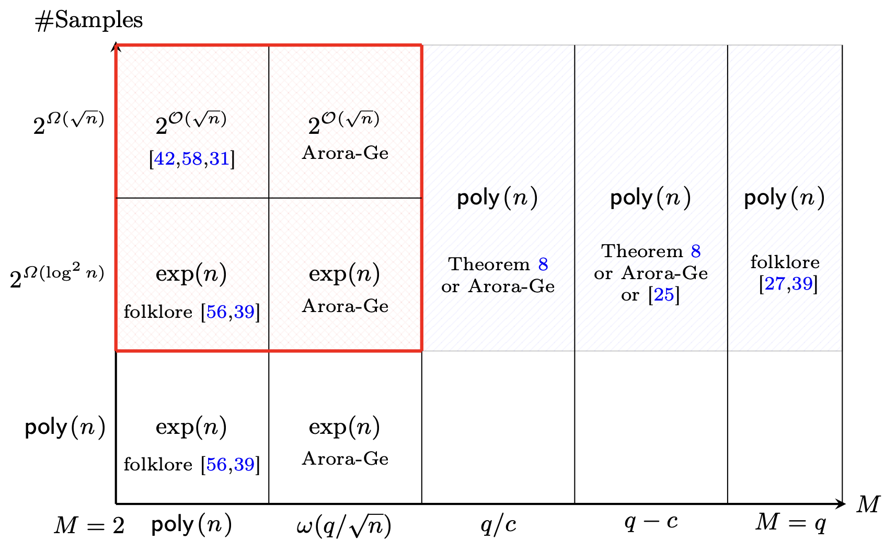

# A Quasi-polynomial Time Algorithm for the Extrapolated Dihedral Coset Problem over Power-of-Two Moduli

**논문 링크**: [https://eprint.iacr.org/2025/1046.pdf](https://eprint.iacr.org/2025/1046.pdf)

## Motivation
LWE의 양자 안전성을 이해하기 위해, LWE와 연결되는 Dihedral Coset 계열 문제들, 특히 EDCP가 실제로 얼마나 어려운지 더 정확히 분석하는 논문이다. 이 논문에서는 EDCP에 대한 quasi-polynomial time 알고리즘을 제안하여, EDCP가 양자적으로도 어려운 문제임을 보여준다.

## 배경 지식
### $S\ket{LWE}$
classical LWE 문제는 $\mathbf{a}_i \xleftarrow{\$} \mathbb{Z}_q^n$, $\mathbf{s} \in \mathbb{Z}_q^n$, $e_i \sim \mathcal{D}_{\mathbb{Z},\alpha q}$에 대해, $b_i = \langle \mathbf{a}_i, \mathbf{s} \rangle + e_i \pmod{q}$ 형태로 표현된다.

$S\ket{LWE}$는 LWE 문제의 양자 버전으로, $\mathbf{a}_i \xleftarrow{\$} \mathbb{Z}_q^n$에 대해, 다음과 같이 주어진 quantum state에서 secret $\mathbf{s} \in \mathbb{Z}_q^n$를 찾는 것이다.
$$ \sum_{e \in \mathbb{Z}_q} \chi(e) \ket{\braket{\mathbf{a}_i, \mathbf{s}} + e \left( \bmod\ q \right)} $$
amplitude $\chi(e)$는 Gaussian과 Uniform 분포 중에서 선택된다.

## Contribution
1. **EDCP에 대한 quasi-polynomial time 알고리즘**: 이 논문에서는 modulus $q=2^k$꼴에 대해, EDCP를 $2^{\mathcal{O}(\log n \log q)}$ 시간에 해결하는 알고리즘을 제시한다. $q = \mathrm{poly}(n)$일 경우, 이 알고리즘은 $2^{\mathcal{O}(\log^2 n)}$ 시간에 문제를 해결할 수 있으므로 quasi-polynomial time 알고리즘이 된다. 이 알고리즘은 U-EDCP에서 어떤 support size $M$, G-EDCP에서 어떤 편차 $r$에 대해서도 작동한다.
2. **$M=q/c$인 경우 U-EDCP에 대한 Polynomial Time 알고리즘**: $M=q/c$인 경우, 즉 $M$이 $q$의 상수 배수인 경우에는, 이 논문에서 제안된 알고리즘이 polynomial time에 문제를 해결할 수 있음을 보여준다. 기존 EDCP 알고리즘은 $M=q-c$인 경우에만 polynomial time 알고리즘을 제공했으므로, 이 결과는 U-EDCP에 대한 알고리즘의 적용 범위를 확장한다.
3. **일반적인 amplitude $f$에 대한 EDCP에서의 quasi-polynomial time 알고리즘**: 이 논문에서는 amplitude $f$가 Gaussian이거나 Uniform이거나 상관없이, $\mathbb{Z}_q$에서 양수이고, non-negligible한 경우이면 polynomial time 알고리즘을 제공한다. 여기에 확장하여, $f$가 알려진 두 점에서 non-negligible한 경우에 quasi-polynomial time 알고리즘을 제공한다.
4. **$S\ket{LWE}$에 대한 quasi-polynomial time 알고리즘**: 이 논문에서는 $S\ket{LWE}$ 문제에 대해서도 quasi-polynomial time 알고리즘을 제안한다. 이 알고리즘은 $S\ket{LWE}$ 문제를 EDCP로 환원하여, EDCP에 대한 알고리즘을 활용하여 $S\ket{LWE}$ 문제를 해결한다. 이는 기존에 subexponential time, subexponential sample이 필요했던 Gaussian amplitude $S\ket{LWE}$ 문제에 대한 알고리즘보다 개선된 결과를 제공한다.

### Related work and comparison

위 그림은 U-EDCP의 알려진 알고리즘 복잡도를 support size M과 sample 수에 따라 정리한 것이다. $M$이 큰 영역에서는 기존 EDCP to LWE reduction과 Arora-Ge 방법으로도 polynomial time에 풀리지만, M이 작은 영역에서는 기존 알고리즘이 subexponential 또는 exponential time이었다.

이 논문은 $q=2^k$이고 $q=\mathrm{poly}(n)$일 때, quasi-polynomial개의 sample을 사용하여 작은 $M$에서도 quasi-polynomial time 알고리즘을 제공한다. 즉, 빨간 영역에서 기존 알고리즘보다 개선된 결과를 제공한다.

### 기존 알고리즘의 발전과정 <- 추후 보강

LWE를 DCP로 환원할 수 있고(DCP가 LWE보다 어려운 문제이므로), Kuperberg 알고리즘은 DCP에서 $2^{\mathcal{O}(\sqrt{n})}$ 시간에 문제를 해결하지만, LWE는 subexponential time 알고리즘으로 풀 수 있다고 말할 수 없다. Kuperberg 알고리즘은 perfect DCP state를 입력으로 받아야 하지만, LWE to DCP reduction에서 Regev reduction은 imperfect state를 생성하기 때문에, Kuperberg 알고리즘을 바로 적용할 수 없다.

## Technical overview
U-EDCP에서 $M=2$인 경우 state는
$$ \ket{0, x} + \ket{1, x+s} $$
이다. 여기서 두 번째 register에 QFT를 적용한 후 측정하면, 다음과 같은 state가 얻어진다.
$$ \ket{0} + \omega_q^{\braket{\mathbf{y}_k, \mathbf{s}}} \ket{1} \quad (\omega_q = e^{2\pi i/q}) $$
이러한 state들을 $n+1$개 얻고 tensor product를 취하면, 다음과 같은 state가 얻어진다. ($\mathbf{Y} = (\mathbf{y}_1, \ldots, \mathbf{y}_{n+1}) \in \mathbb{Z}_q^{n\times (n+1)}$)
$$ \sum_{\mathbf{j}\in\mathbb{Z}_2^{n+1}} \omega_q^{\braket{\mathbf{Y}\cdot \mathbf{j}, \mathbf{s}}} \ket{\mathbf{j}} $$
$\mathbf{Y}\cdot \mathbf{j} \pmod 2$를 계산하여 새 register에 넣고, 측정하면 아래와 같은 state가 얻어진다. ($\mathbf{x}_0, \mathbf{x}_1$은 $\mathbf{Y}\cdot \mathbf{j}\equiv \mathbf{t}\pmod 2$를 만족하는 unique solution, $\mathbf{t}$는 측정 값)
$$ \omega_q^{\braket{\mathbf{Y}\cdot\mathbf{x}_0, \mathbf{s}}} \ket{\mathbf{x}_0} + \omega_q^{\braket{\mathbf{Y}\cdot\mathbf{x}_1, \mathbf{s}}} \ket{\mathbf{x}_1} $$
$\omega_q^{\braket{\mathbf{Y}\cdot\mathbf{x}_0, \mathbf{s}}}$를 묶어 global phase로 나타내고, $\ket{\mathbf{x}_0} \mapsto \ket{0}$, $\ket{\mathbf{x}_1} \mapsto \ket{1}$로 매핑하면, 이 state는 아래와 같이 나타낼 수 있다.
$$ \ket{0} + \omega_q^{\braket{\mathbf{Y}\cdot(\mathbf{x}_1-\mathbf{x}_0), \mathbf{s}}} \ket{1} = \ket{0} + \omega_{q/2}^{\braket{\mathbf{y}', \mathbf s}} \ket{1} $$
> $\mathbf{Y}\mathbf{x}_0 \equiv \mathbf{Y}\mathbf{x}_1 \equiv \mathbf{t} \pmod 2$이므로, $\mathbf{Y}(\mathbf{x}_1-\mathbf{x}_0) \equiv 0 \pmod 2$이다. 따라서 $\mathbf{Y}(\mathbf{x}_1-\mathbf{x}_0) = 2\mathbf{y}'$인 어떤 $\mathbf{y}'$가 존재한다.
>
> $\omega_q^2 = e^{2\pi i \cdot 2/q} = e^{2\pi i / (q / 2)}= \omega_{q/2}$이므로, $\omega_q^{\braket{2\mathbf{y}', \mathbf{s}}} = \omega_{q/2}^{\braket{\mathbf{y}', \mathbf{s}}}$가 된다.

즉, modulus $q$인 state에서 modulus $q/2$인 state를 얻을 수 있다. 이 과정을 반복하여, $q=2^k$인 경우에는 $k-1$번 반복하면 modulus $2$인 state를 얻을 수 있다. modulus $2$에서는 $\omega_2 = e^{2\pi i / 2} = -1$이므로, 이 과정을 $n$번 반복하여 아래와 같이 state를 나타낼 수 있다.
$$ \left\{ \ket{0} + (-1)^{\braket{\mathbf{y}_k, \mathbf{s}}} \ket{1} \right\}_{k=1}^n $$
이 state를 Hadamard basis에서 측정하면 $\braket{\mathbf{y}_k, \mathbf{s}} \pmod 2$를 얻을 수 있고, $n$개의 선형 독립인 state로부터 각 $\mathbf{s}_i$의 최하위 1비트를 얻을 수 있다. 이후 최하위 1비트를 제거한 $\mathbf{s}'$에 대해서도 같은 과정을 반복하여, $\mathbf{s}$의 모든 비트를 얻을 수 있다.

각 step에서 최종적으로 modulus $2$인 state를 얻기 위해서는, $n+1$개의 $q$-modulus state가 필요하고, 이 과정을 $\log q$번 반복해야 하므로, 총 $(n+1)^{\mathcal{O}(\log q)} = 2^{\mathcal{O}(\log n \log q)}$개의 state가 필요하다.

Kuperberg 알고리즘에서는, 한 step에서 여러 비트를 처리하였지만, 이 논문에서는 한 step에서 한 비트만 처리하여, 각 step마다 $n+1$개의 state가 필요하도록 하였다. 이렇게 하면, 각 step에서 필요한 state 수가 polynomial이 되므로, 전체적으로 quasi-polynomial time 알고리즘이 된다.